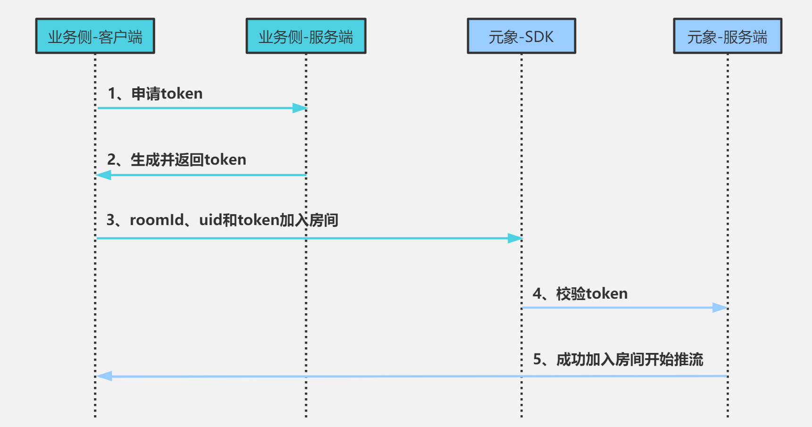

# Token鉴权


##鉴权的基本流程
1. 元象给业务侧分配appId，secretKey(sk), skver，并提供生成token的算法，业务侧提供生成token的服务，并维护sk的安全，
2. 业务侧客户端向自己的服务端申请token
3. 拿到token后，客户端带上roomId、uId、token去访问SDK
4. 元象服务端校验token，校验通过则开始推流


## token生成算法流程
1. sig=HMAC-SHA256(sk, skver, appId, uId, expireTime, salt) ```说明：salt保证同一个appId, uId每次生成的token不同; skver用于支持密钥轮换```
2. token=Base64Encode(appId, uId, expireTime, salt, skver, sig)

